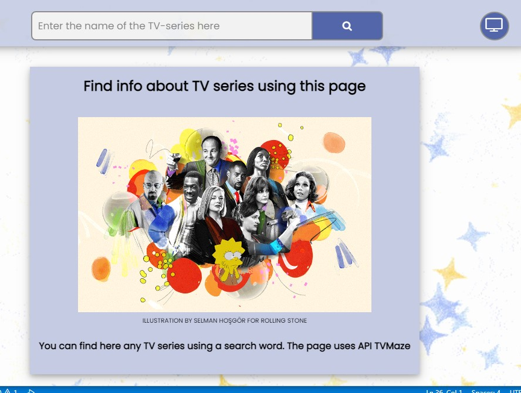

# TV Show Search - AJAX

This application is a simple TV series search engine, making use of the TVMaze API to retrieve and display information about TV shows.

## Table of Contents

- [Introduction](#introduction)
- [Technologies](#technologies)
- [Features](#features)
- [Screenshots](#screenshots)
- [Setup](#setup)

## Introduction

This project is part of the AJAX module assignment, where the goal was to build a web application that retrieves information about a TV series entered by the user and displays it. The user input is used to send a fetch request to the TVMaze API, and the search result is printed on the webpage.

## Technologies

Project is created with:

- HTML5
- CSS3
- JavaScript (ES6)
- AJAX for API request

## Features

- Allows users to search for TV shows
- Retrieves and displays TV show name, details (URL), medium image, and summary
- Links to TV show details are opened in a new tab
- Handles cases where a TV show doesn't have an image to avoid errors using optional chaining
- Each search result is wrapped in an `<article>` element
- Clears old search results before appending new ones

## Screenshots

## Setup

To run this project, simply clone the project and open `index.html` in your preferred web browser.
